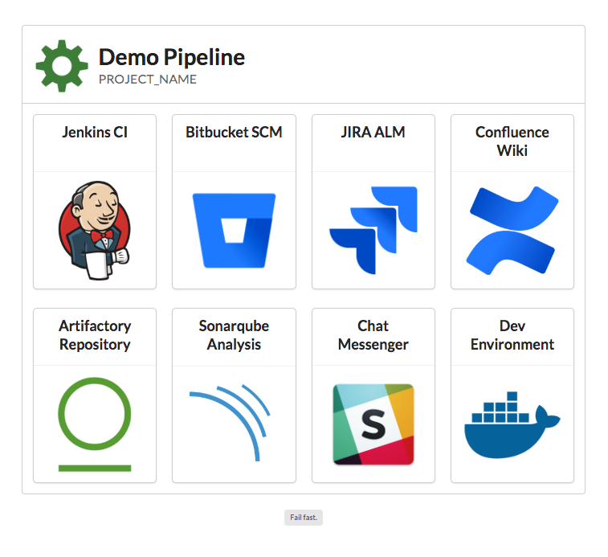

# pipeline-home

This is a versatile home page for a set of DevOps tools in a pipeline.



# about

This project...
- was bootstrapped with [Create React App](https://github.com/facebookincubator/create-react-app)
- uses [prettier](https://github.com/facebook/create-react-app/blob/master/packages/react-scripts/template/README.md#formatting-code-automatically) to format JavaScript
- styles components with [Semantic UI React](https://react.semantic-ui.com/introduction)

# customize

Update the properties in `src/template/site.js`.

# install

Install Yarn. On Mac:
```bash
brew install yarn
```

Install packages.
```bash
yarn install
```

# run

The application will be served at [http://localhost:3000](http://localhost:3000).
```bash
yarn start
```

# deploy

```bash
yarn install --production
yarn run build
```

